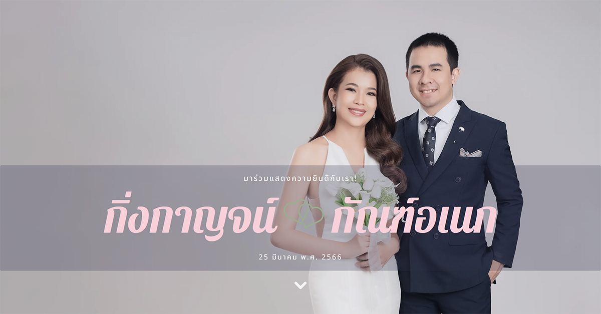
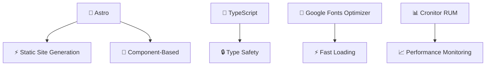

# 💒 Wedding Day: Kingkan & Kananek ✨

### _รักแท้ไม่มีวันสิ้นสุด เมื่อใจดวงหนึ่งมาพบกับใจอีกดวงหนึ่ง_ 💕

<div align="center">



[](https://astro.build)
[](https://www.typescriptlang.org/)
[](https://tailwindcss.com/)

**#KK3rdStory** 📖

</div>

---

## 🌟 เกี่ยวกับเว็บไซต์

เว็บไซต์แสดงรักและความสุขของคิงกัน 👰‍♀️ และกานเนตค์ 🤵‍♂️ ที่สร้างด้วยเทคโนโลยีล้ำสมัย เพื่อเป็นที่ระลึกและแชร์ความสุขในวันพิเศษกับทุกคนที่รัก

🌐 เว็บไซต์จริง: [wedding.ourkk.com](https://wedding.ourkk.com/)

### ✨ ไฮไลท์พิเศษ

- 🎭 **การออกแบบที่ไม่เหมือนใคร** - UI/UX ที่สวยงามและทันสมัย
- 📱 **Responsive Design** - ดูสวยทุกหน้าจอ ทุกอุปกรณ์
- 🚀 **Performance สุดเร็ว** - โหลดเร็วด้วย Astro Static Site Generation
- 🌏 **SEO Optimized** - หาเจอง่ายใน Google
- 📍 **แผนที่นำทาง** - ไม่มีหลงทางในวันสำคัญ
- 💌 **Gallery ความทรงจำ** - รวบรวมช่วงเวลาสวยงาม

---

## 🎯 ฟีเจอร์หลัก

| 🎪 ส่วนประกอบ   | 📝 รายละเอียด                      |
| --------------- | ---------------------------------- |
| 🏠 **หน้าหลัก** | ข้อมูลงานแต่งงาน, กำหนดการ, แผนที่ |
| 🖼️ **แกลลอรี่** | รูปภาพความทรงจำสวยๆ                |
| 📍 **แผนที่**   | สถานที่จัดงาน 2 ล็อเคชั่น          |
| ❓ **FAQ**      | คำถาม-คำตอบที่พบบ่อย               |

---

## 🧪 เริ่มต้นพัฒนา

ติดตั้ง dependencies:

```bash
bun install
```

รัน development server:

```bash
bun run dev
```

build production:

```bash
bun run build
```

ถ้าต้องการใช้ npm ก็สามารถใช้ `npm install`, `npm run dev` และ `npm run build` ได้เช่นกัน

---

## 🗓️ กำหนดการสำคัญ

### 📅 วันที่ 1: พิธีแห่ขันหมาก & หมั้น

**📍 ตำบลวังคีรี อำเภอห้วยยอด จังหวัดตรัง**

- ⏰ 09:00 - พิธีแห่ขันหมาก
- 💍 10:00 - พิธีหมั้น
- 💧 10:30 - พิธีรดน้ำสังข์
- 🍽️ 14:30 - งานเลี้ยงฉลองมงคลสมรส

### 📅 วันที่ 2: งานเลี้ยงมงคลสมรส

**📍 ตำบลปากตะโก อำเภอทุ่งตะโก จังหวัดชุมพร**

- 🌅 08:00 - งานเลี้ยงมงคลสมรส (โต๊ะไทยสำเร็จ)

---

## 🛠️ เทคโนโลยีที่ใช้

<div align="center">



</div>

### 🎪 Stack หลัก

- **🚀 Astro** - Modern Static Site Generator
- **📝 TypeScript** - Type-safe JavaScript
- **🎨 CSS3** - Custom Styling & Animations
- **🌐 Google Fonts** - Typography ที่สวยงาม
- **📊 Cronitor** - Real-time monitoring

---

## 📸 แชร์ความสุข

อย่าลืมแชร์ภาพความสุขในงานและใส่ hashtag:

<div align="center">

### **#KK3rdStory** 📖✨

_เพราะทุกความรักต้องการเรื่องราวที่สวยงาม_

</div>

---

<div align="center">

**💕 ขอบคุณทุกคนที่เป็นส่วนหนึ่งในเรื่องราวความรักของเรา 💕**

_สร้างด้วยความรัก 💖 และเทคโนโลยี 🚀_

[](https://github.com/ourkk/wedding-day)

</div>
